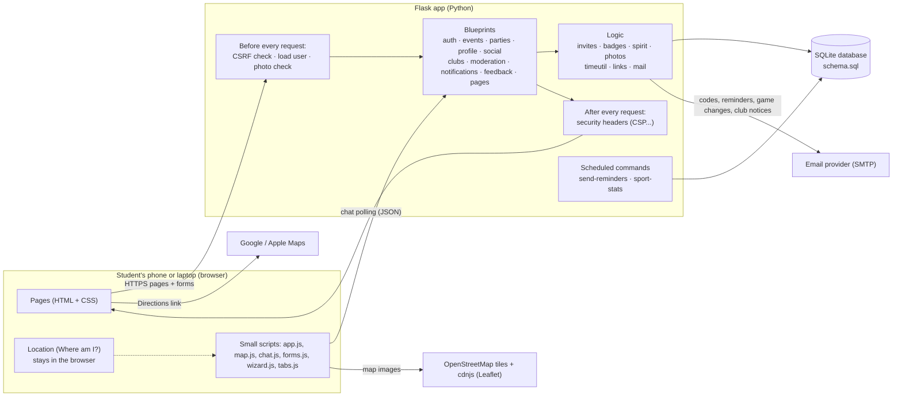
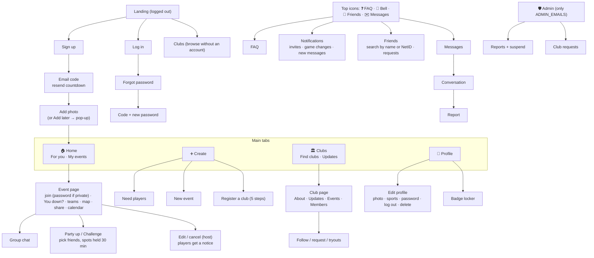
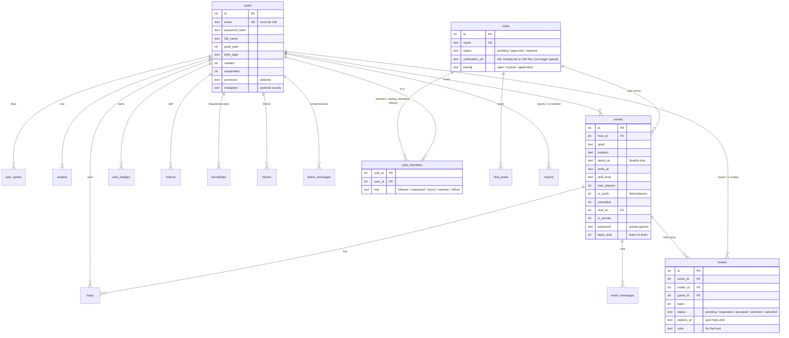
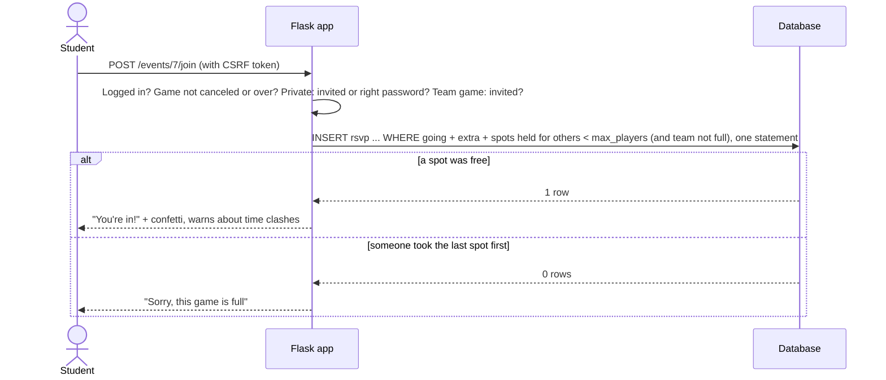
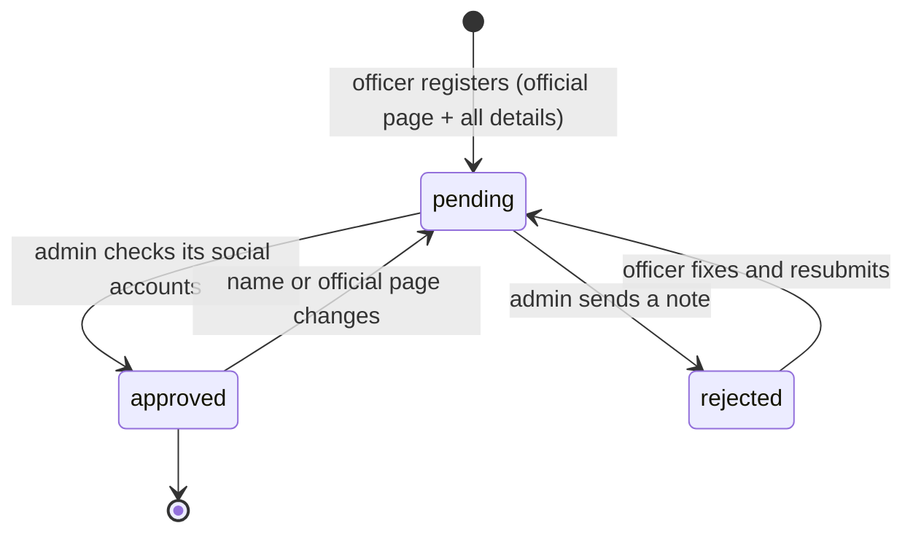
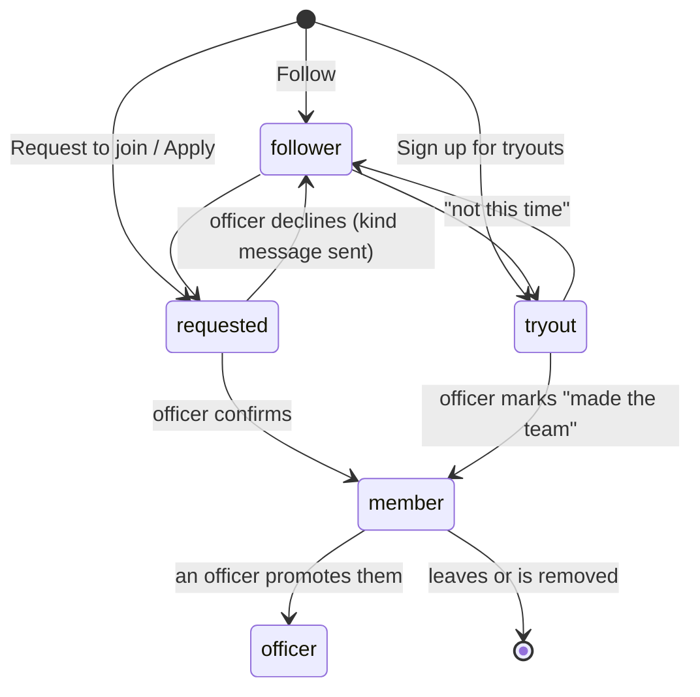
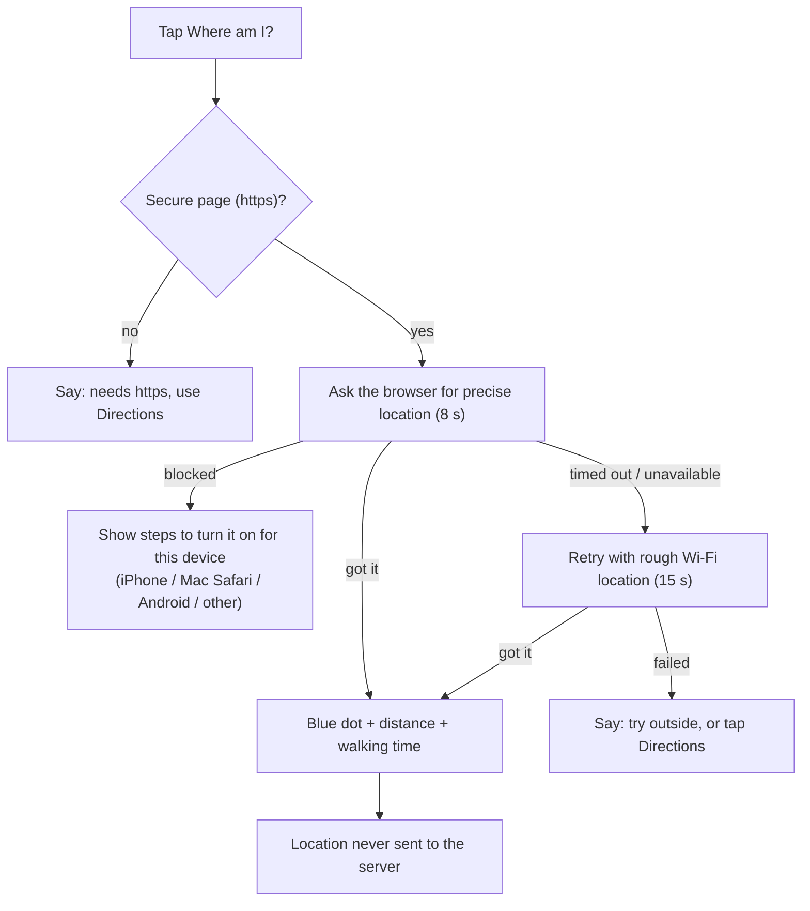
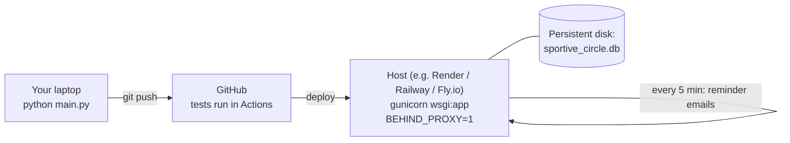

# Sportive Circle @ UW: System map

How the pieces fit together. The diagrams are [Mermaid](https://mermaid.js.org/), which GitHub
draws automatically.

## 1. Architecture



**Why this shape?** Server-rendered pages work on any phone, need no app store, and keep the code
small enough for one student to maintain. Each area of the app is its own module (a Flask
*blueprint*), so a change to clubs can't break messaging.

## 2. Code map

| File | What it does |
|---|---|
| `sportive/__init__.py` | Builds the app: settings, blueprints, error pages, security headers. |
| `sportive/constants.py` | Sports, campus places, map pins, usual game sizes. **Edit this to add a sport or place.** |
| `sportive/schema.sql`, `db.py` | Database tables and automatic upgrades for existing databases. |
| `sportive/auth.py` | Sign up, email codes, log in/out, forgot password, CSRF. |
| `sportive/events.py` | Feed and filters, events (private, team vs team), Need players, joining, change notices, calendar files. |
| `sportive/invites.py`, `parties.py` | Invites and held spots (30 min), Party up, "You down?", host approval in private games, team challenges. |
| `sportive/notifications.py` | Tab numbers, the bell, notices (invites, game changes), notification settings. |
| `sportive/badges.py` | Badges (earned, seasonal, and given ones like Tester). |
| `sportive/clubs.py` | Club directory, registration, membership, updates, admin review. |
| `sportive/social.py` | Friends, name/NetID search, blocking, direct messages, event chats. |
| `sportive/profile.py` | Profiles (pronouns, gender, socials), photos, badge locker, settings, change password, delete account. |
| `sportive/moderation.py` | Reports and the admin page (review, suspend). |
| `sportive/feedback.py` | Suggestions and trending topics for admins. |
| `sportive/pages.py` | How it works, FAQ, Privacy, Terms, the Create menu. |
| `sportive/sms.py`, `phones.py`, `announcements.py` | Texts (Twilio): codes, limits, updates; phone numbers with a country picker; the one-time "texts are here" announcement. |
| `sportive/placecheck.py` | "What else is on at this place?": UW Rec reservations (and the admin page to add them) and other games. |
| `sportive/settings.py` | Settings pages: notifications, look (theme), reminders, texts, password, blocked people. |
| `sportive/photos.py` | Profile photos and club logos: cropped, resized, hidden info removed. |
| `sportive/spirit.py` | The Home greeting and Top Dawgs. |
| `sportive/mail.py`, `links.py` | Sending email; full links to the live site for emails, calendar files and share buttons. |
| `sportive/timeutil.py`, `textutil.py` | Seattle time and "5 min ago" style times; cleaning up typed text. |
| `sportive/reminders.py`, `stats.py` | Game reminders (a loop inside the app on Render, or `/tasks/send-reminders`) and usage stats. |
| `sportive/templates/` | Pages. `base.html` has the navigation; `_macros.html` has shared pieces. |
| `sportive/static/` | Stylesheet, icons, and the small scripts. |
| `tests/` | Unit tests (`test_app.py`) and Gherkin scenarios (`features/*.feature`). |

## 3. Screen map

The same four tabs everywhere: a bottom bar on phones and a sidebar on laptops.



## 4. Data model



Times are stored as Seattle local time (`YYYY-MM-DD HH:MM`), which sorts correctly as text.
Deleting a user cascades to their data; reports and club posts keep the text with the name removed.

## 5. Key flows

### Joining a game (without overbooking)



### Party up (playing with friends)

```mermaid
sequenceDiagram
    actor M as Maya (player)
    participant A as Flask app
    participant D as Database
    actor J as Jordan (friend)
    M->>A: Party up: pick Jordan and Sam
    A->>D: BEGIN IMMEDIATE (lock)
    A->>D: enough room for Maya (if not in yet) + 2? then add Maya, invites held 30 min
    A->>D: COMMIT
    A-->>J: 🔔 "Maya wants you in Sunday hoops. You down?"
    alt I'm in
        J->>A: yes → takes the held spot
        A-->>M: 🔔 "Jordan is in"
    else Can't make it
        J->>A: no → spot free for anyone
        A-->>M: 🔔 "Jordan can't make it"
    else no answer in 30 min
        Note over D: the hold ends by itself; the invite still works if there's room
    end
```

In a private game, friends that a player (not the host) brings start as *requests* with a note; the
host approves (then the spot is held) or declines. In team vs team, the host's party is team 1 and a
second group claims team 2 with the same flow ("Challenge").

### Club verification



### Becoming a club member



### "Where am I?"



## 6. Deployment



See [deployment.md](deployment.md) for step-by-step instructions.
