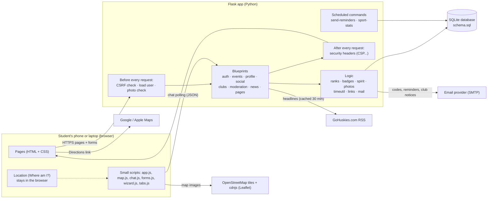
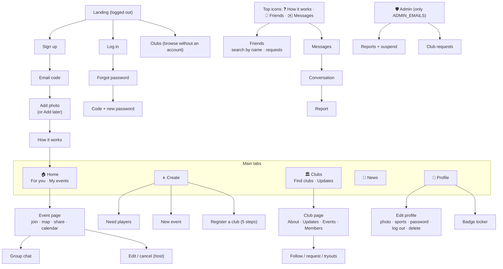
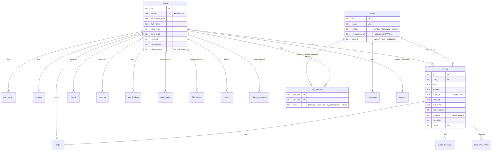
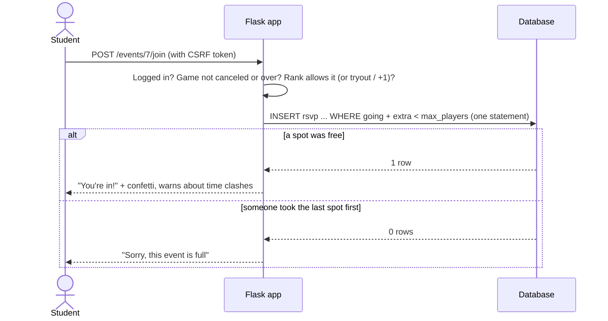
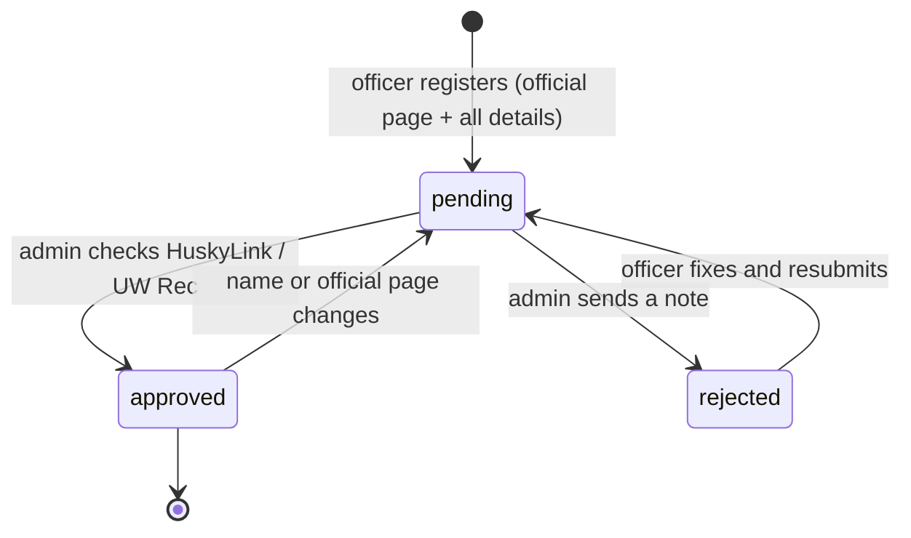
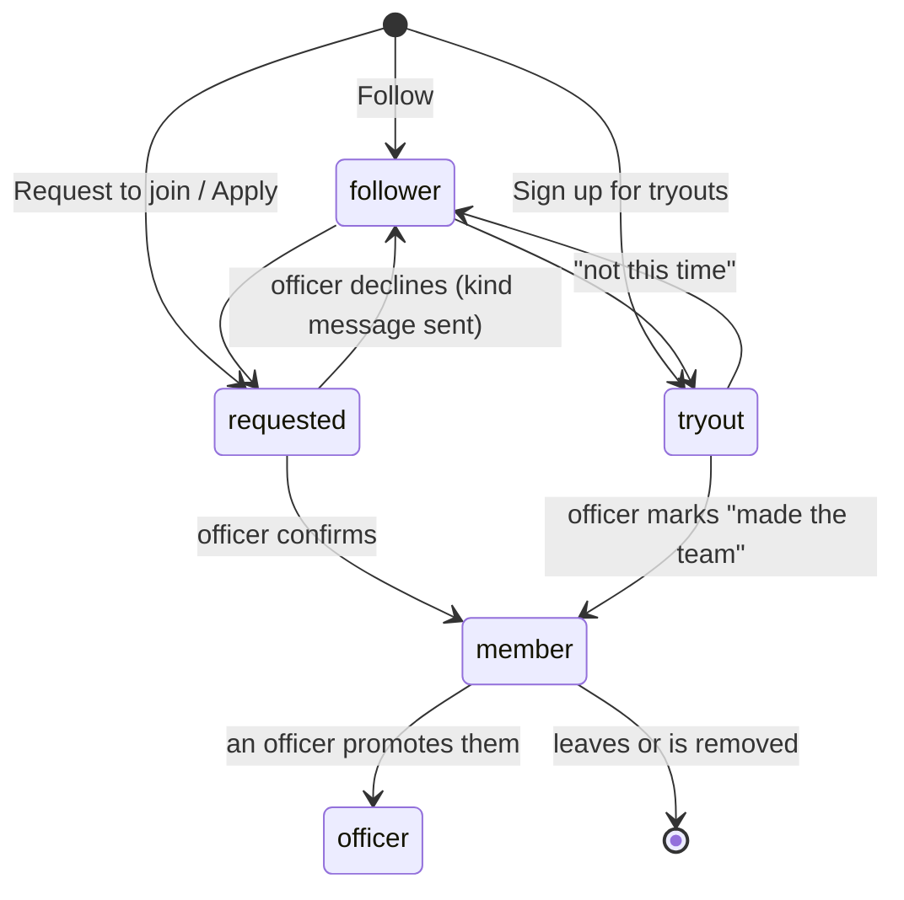
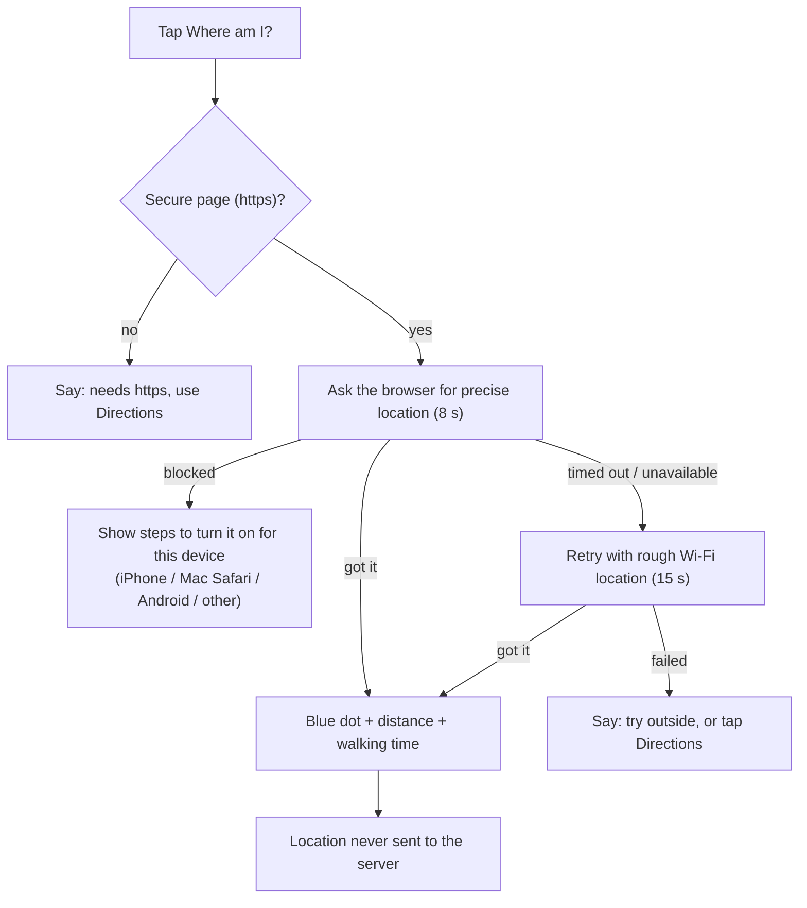
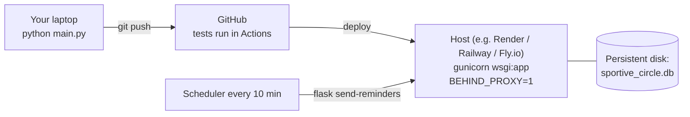

# Sportive Circle @ UW: System map

How the pieces fit together. The diagrams are [Mermaid](https://mermaid.js.org/), which GitHub
draws automatically.

## 1. Architecture

**Why this shape?** Server-rendered pages work on any phone, need no app store, and keep the code
small enough for one student to maintain. Each area of the app is its own module (a Flask
*blueprint*), so a change to clubs can't break messaging.

## 2. Code map

| File | What it does |
|---|---|
| `sportive/__init__.py` | Builds the app: settings, blueprints, error pages, security headers. |
| `sportive/constants.py` | Sports, campus places, map pins, player caps. **Edit this to add a sport or place.** |
| `sportive/schema.sql`, `db.py` | Database tables and automatic upgrades for existing databases. |
| `sportive/auth.py` | Sign up, email codes, log in/out, forgot password, CSRF. |
| `sportive/events.py` | Feed, events, Need players, joining, props, vouches, +1s, tryouts, calendar files. |
| `sportive/ranks.py`, `badges.py` | Rank math and badges. |
| `sportive/clubs.py` | Club directory, registration, membership, updates, admin review. |
| `sportive/social.py` | Friends, name search, blocking, direct messages, event chats. |
| `sportive/profile.py` | Profiles, photos, badge locker, settings, change password, delete account. |
| `sportive/moderation.py` | Reports and the admin page (review, suspend). |
| `sportive/news.py` | GoHuskies headlines. |
| `sportive/pages.py` | How it works, Privacy, Terms, the Create menu. |
| `sportive/reminders.py`, `stats.py` | Commands run on a schedule. |
| `sportive/templates/` | Pages. `base.html` has the navigation; `_macros.html` has shared pieces. |
| `sportive/static/` | Stylesheet, icons, and the small scripts. |
| `tests/` | Unit tests (`test_app.py`) and Gherkin scenarios (`features/*.feature`). |

## 3. Screen map

The same five tabs everywhere: a bottom bar on phones and a sidebar on laptops.

## 4. Data model

Times are stored as Seattle local time (`YYYY-MM-DD HH:MM`), which sorts correctly as text.
Deleting a user cascades to their data; reports and club posts keep the text with the name removed.

## 5. Key flows

### Joining a game (without overbooking)

### Club verification

### Becoming a club member

### "Where am I?"

## 6. Deployment

See [deployment.md](deployment.md) for step-by-step instructions.
